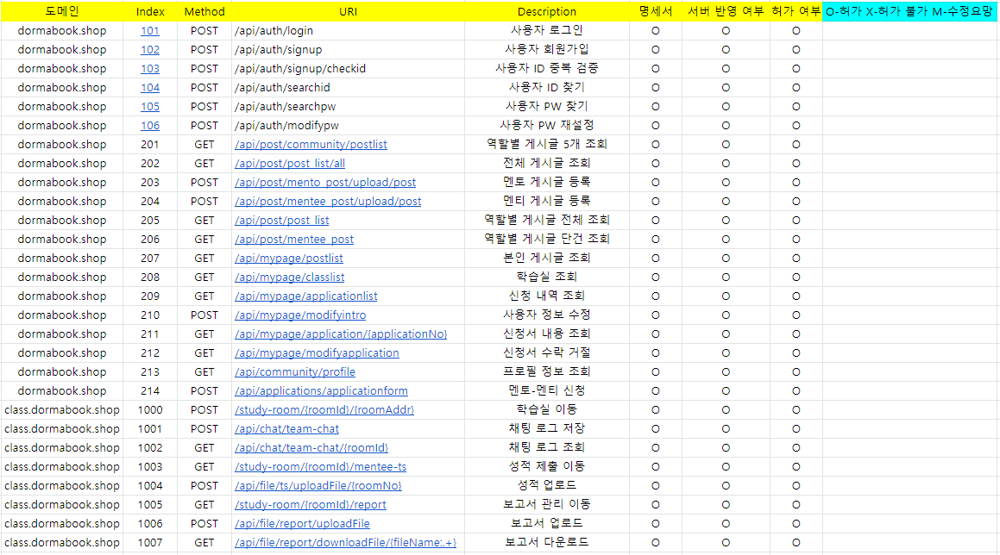

# 책을 통한 멘토-멘티 플랫폼 “도르마북”

**Project Repositories:**  
- [커뮤니티 프론트](https://github.com/rlarlxo2323/dormabook-front)
- [커뮤니티 백엔드(*)](https://github.com/rlarlxo2323/dormabook-server)
- [학습실](https://github.com/rlarlxo2323/dormabook-webRTC)

## 목차
1. [개요](#1-개요)
2. [개발 환경](#2-개발-환경)
3. [주요 기능](#3-주요-기능)
4. [설계](#4-설계)
5. [시연 영상](#5-시연-영상)

## 1. 개요

  본 프로젝트(이하 도르마북)는 기존 멘토-멘티 프로그램을 신청할 때 생길 수 있는 문제점을 개선하여 책을 통한 자연스러운 팀원 매칭을 유도하고, 시간과 장소에 구애받지 않도록 온라인 학습 공간을 제공할 수 있다.

 기존 멘토-멘티를 진행하기 위해서는 스스로 팀을 꾸려 신청을 해야 하는 방식에서 어려움을 겪는 학생들이 존재한다. 신입생들은 학기 초, 도움을 구할 선배를 찾는 것이 쉽지 않으며 코로나19 여파로 선후배 간의 연대가 약화되어 더더욱 팀원을 구하는 것이 어려워진 상황이다. 도르마북은 책이라는 매개체를 통해 팀을 꾸리기 어려운 학생들에게 자연스러운 팀 매칭이 이루어지도록 함으로써 누구나 쉽게 멘토링 프로그램에 참여할 수 있도록 한다.

 책을 통해 매칭되는 팀원과의 멘토링 서비스를 제공함으로써 학생들의 학습 능력과 선후배 간의 학문적 연대감을 향상시키고, 건전한 학습공동체를 조성할 수 있다. 더 나아가 도르마북은 멘토링 프로그램을 제공하기 위한 모든 교육 기관에서 원활한 학습의 장이 열릴 수 있도록 활용될 수 있다.

## 2. 개발 환경
```
* OS : Windows 10, Ubuntu 18.04 LTS
* Platform : Spring-boot, AWS EC2
* DB : AWS RDS(MySQL 8.0.28)
* IDE : IntelliJ
* Library : Lombok, Spring Security, WebSocket, etc
* Api : NAVER SMS API
```

## 3. 주요 기능  
가. 사용자 기능
1) 회원가입  
● 서비스를 사용할 사용자는 회원가입을 진행한다.  
● 사용자의 정보와 더불어 단과대학, 학과, 학번을 입력한다.  

2) 로그인    
● 아이디와 비밀번호를 입력하여 로그인할 수 있다.  
● 로그인 성공 시 커뮤니티 화면으로 이동한다.    

3) ID 찾기, PW 재설정    
● 아이디를 잊어버렸을 때 찾을 수 있는 기능이다.    
● 비밀번호를 잊어버렸을 때 재설정 할 수 있는 기능이다.  
● 사용자는 아이디와 전화번호를 입력하여 인증번호를 받을 수 있다.   
● 문자로 받은 인증번호를 입력하여 사용자임을 인증한다.   
● 재설정할 비밀번호와 재확인 비밀번호를 입력한다.  
  
나. 커뮤니티 기능    
1) 게시글 관리     
● 전체, 멘토, 멘티 구분에 따른 게시글 확인이 가능하다.     
● 사용자는 멘토, 멘티의 역할을 선택하여 상대를 구하는 게시글을 작성할 수 있다.    
● 멘토의 역할로 게시글을 작성하는 경우 해당 과목의 성적을 증명하는 성적증명서를 제출해야한다.   

2) 팀원 신청  
● 사용자는 다른 사용자의 게시글을 보고 매칭 신청서를 작성할 수 있다.    
● 사용자는 마이페이지의 신청서 목록을 통해 신청서를 확인할 수 있으며, 반려와 승인이 가능하다.    
● 승인 시 게시글 작성자와 신청자만의 학습실이 개설된다.    

3) 회원 정보 관리(마이페이지)      
● 사용자는 본인의 소개서를 마이페이지에서 작성할 수 있다.     
● 본인이 작성한 게시글 목록을 확인할 수 있다.   
● 본인이 작성한 게시글에 신청된 신청서의 목록을 확인할 수 있다.   
● 본인이 속한 학습실의 목록을 확인할 수 있다.   

다. 학습실 기능     
1) 채팅     
● 멘토와 멘티는 학습실을 통해 채팅이 가능하다.  
● 학습실 입장 시, 기존 채팅 내역을 날짜별로 구분하여 확인할 수 있다.  

2) 화상 채팅      
● 멘토와 멘티는 개설된 화상채팅방을 통해 화상채팅이 가능하다.  
● 제어 버튼을 이용하여 음소거와 카메라 끄기가 가능하다.  
    
3) 회의록 및 보고서 관리   
● 멘티는 주차별 보고서를 업로드 및 다운로드할 수 있다.   
● 멘티는 학기가 끝난 뒤 성적 증명서를 제출할 수 있다.  


## 설계
### 디자인 설계
1. 홈 화면 및 로그인 관련 기능  


2. 커뮤니티 기능


3. 마이페이지 기능


4. 학습실 기능


### 서버 아키텍쳐
#### 전체 서버 아키텍처


#### WebRTC 서버 아키텍처


### DB 설계
#### 홈, 커뮤니티 관련 ERD


#### 학습실 관련 ERD


### API 설계
#### API 리스트


## 시연 영상 및 발표 영상
[](https://youtu.be/F9T6PEUqbiA)  


## Contributors

<a href="https://github.com/Bonyeong1998">
</a>
<a href="https://github.com/rlarlxo2323">
</a>
<a href="https://github.com/AnHyeontaek">
</a>
<a href="https://github.com/ads0070">
</a>
<a href="https://github.com/kkb-98">
</a>
