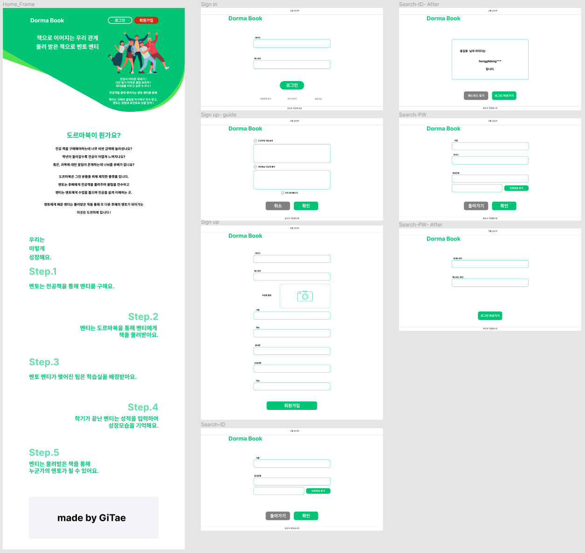
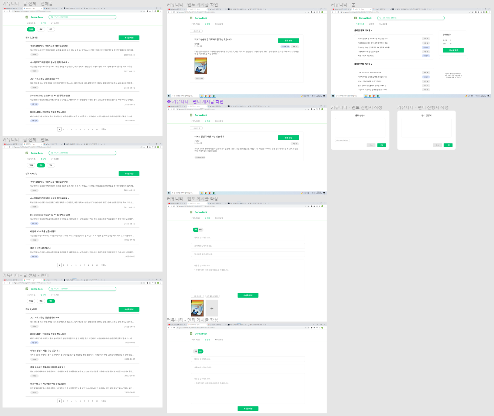
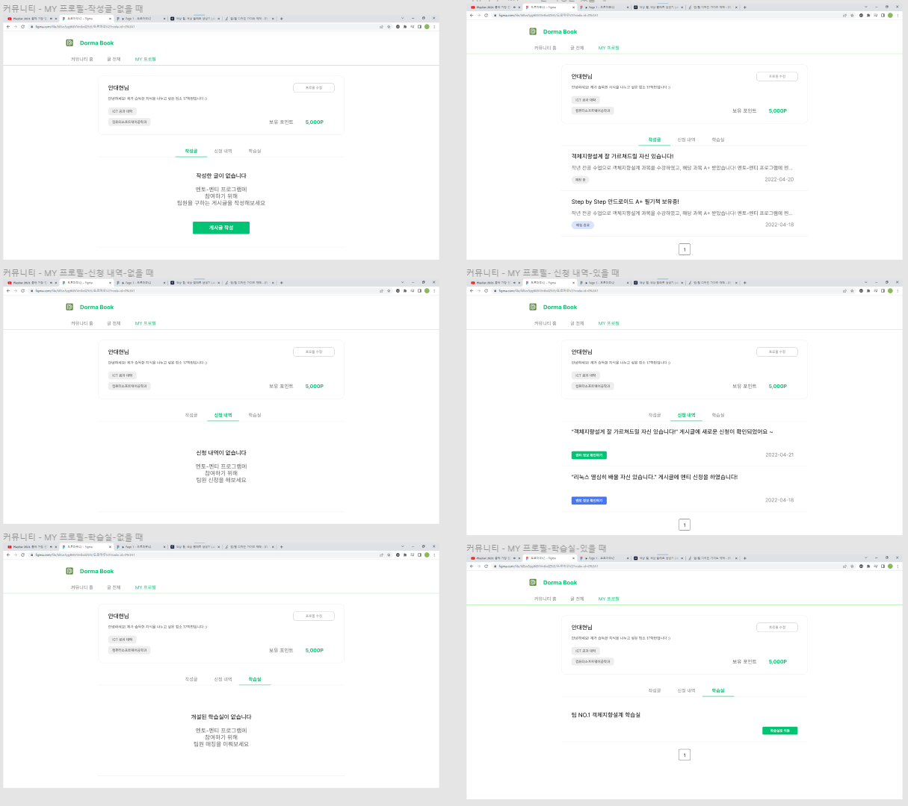
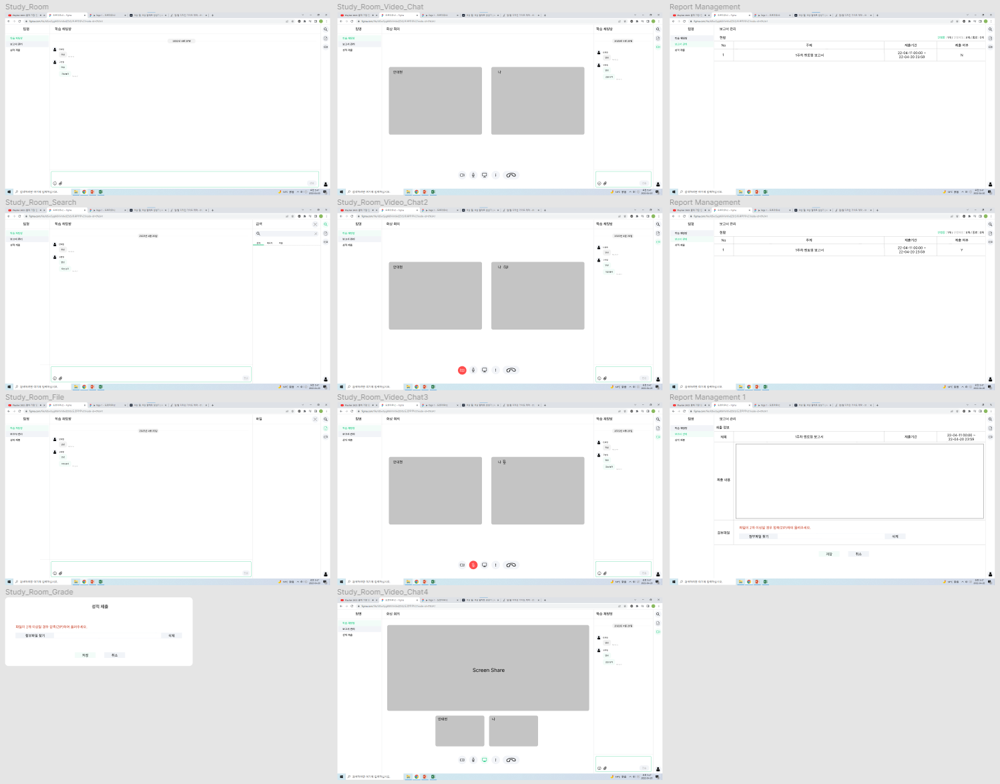
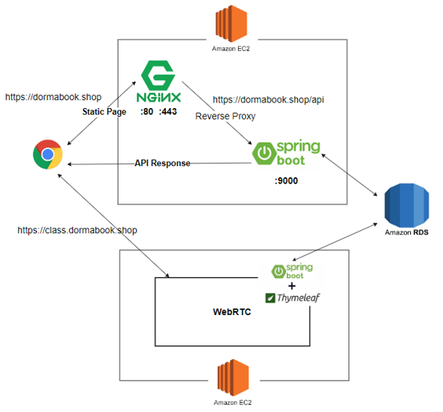
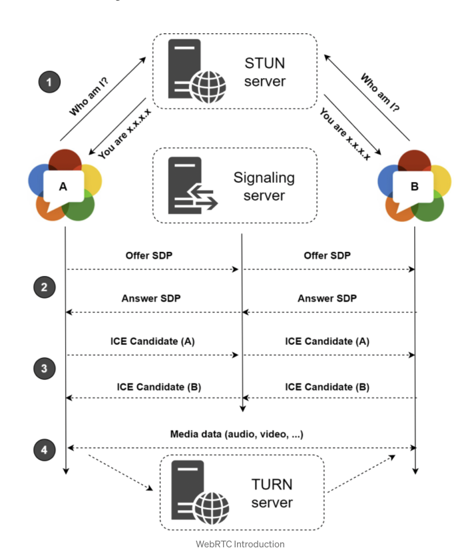
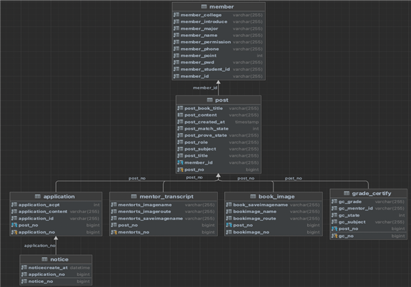
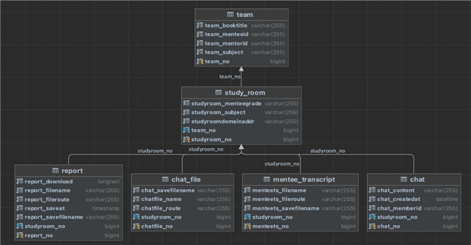

# Dormabook(Server)-멘토,멘티 매칭 및 학습 시스템

## 개요

코로나-19 바이러스로 인해 무인 시스템의 발전이 가속화되고 있는 가운데, 이미 많은 매장에서는 키오스크와 같은 무인 시스템을 도입해 사용 중이다. 하지만 키오스크는 고령층의 사용법 미숙과 더불어 한정된 수량으로 인한 대기시간 증가문제가 잇달아 나타나고 있다.

이 서비스의 목표는 다음과 같다

QR코드를 사용한 주문 및 결제 방식은 현대 사회에서 널리 보급된 스마트폰에서 이루어지기 때문에 사용자 입장에서는 대기시간 없이 좀 더 간편하고 빠르게 서비스를 이용할 수 있다. 또한, 키오스크와 같은 별도의 기기가 필요하지 않기 때문에 초기 비용에 대한 부담을 덜 수 있다.

## 개발 환경
```
* Platform : Spring-boot, AWS(EC2, RDS)
* RDBMS : MySQL 8.0
* IDE :  Intellij 2021.2.3 Ultimate Edition
* Library : Lombok, Spring Security, WebSocket ... etc
* Api : NAVER SMS API
```

서비스의 주요 기능은 다음과 같다  
가. 공통기능
1) 회원가입  
● 서비스를 사용할 사용자와 서비스에 가맹점을 등록하는 가맹점주가 회원가입을 진행한다.  
● 사용자와 가맹점주는 아이디, 비밀번호, 전화번호, 이름은 공통으로 입력한다.  
● 가맹점주는 사업자번호, 가맹점명, 가맹점 위치를 추가로 입력한다.  

2) 로그인  
● 사용자의 구분에 따라 가맹점주, 일반 사용자를 선택할 수 있다.  
● 선택한 구분에 따라 아이디와 비밀번호를 입력하여 로그인할 수 있다.  

3) 비밀번호 재설정  
● 비밀번호를 잊어버렸을 때 재설정 할 수 있는 기능이다.  
● 사용자와 가맹점주는 아이디와 전화번호를 입력하여 회원임을 인증한다.  
● 재설정할 비밀번호와 재확인 비밀번호를 입력한다.  

나. 가맹점주 기능  
1) 좌석 관리  
● 사용자가 해당 테이블에 주문한 메뉴이름, 메뉴수량, 가격을 확인할 수 있다.  
● 사용자가 테이블 사용이 끝나면 가맹점주는 토글버튼으로 테이블이 비었음을 알린다.  

2) 메뉴 관리  
● 가맹점주는 메뉴 추가할 때 메뉴 이미지, 메뉴명, 메뉴 설명, 가격을 기입한다.  
● 추가한 메뉴를 확인할 수 있으며 삭제도 가능하다.  

3) 매출 확인  
● 날짜를 선택하여 해당 날짜에 매출을 확인할 수 있다.  
● 매출 확인은 메뉴명, 판매수량, 총 합계 확인이 가능하다.  

다. 사용자 기능  
1) 매장 검색  
● 사용자는 검색창을 통해 매장 검색이 가능하다.  
● 사용자의 주변에 존재하는 매장을 마커를 통해 화면에 표시한다.  

2) 메뉴 확인  
● 사용자는 선택한 매장의 메뉴를 확인한다.  
● 메뉴 이름, 메뉴 설명, 메뉴 가격을 확인할 수 있다.  

3) 좌석 확인  
● 사용자는 선택한 매장의 좌석현황을 확인할 수 있다.  

4) QR 주문 및 결제  
● QR코드를 이용하여 해당 가맹점의 주문으로 이동할 수 있다.  
● 원하는 음식을 선택 및 취소가 가능하다.  
● 선택한(장바구니) 메뉴에 대해 결제가 가능하다.  

## 설계
### 디자인 설계
1. 홈 화면 및 로그인 관련 기능  


2. 커뮤니티 기능


3. 마이페이지 기능


4. 학습실 기능


### 서버 아키텍쳐
#### 전체 서버 아키텍처


#### WebRTC 서버 아키텍처


### DB 설계
#### 홈, 커뮤니티 관련 ERD


#### 학습실 관련 ERD



## 시연 영상 및 발표 영상
[](https://youtu.be/F9T6PEUqbiA)  


## Contributors

<a href="https://github.com/Bonyeong1998">
</a>
<a href="https://github.com/rlarlxo2323">
</a>
<a href="https://github.com/ads0070">
</a>
